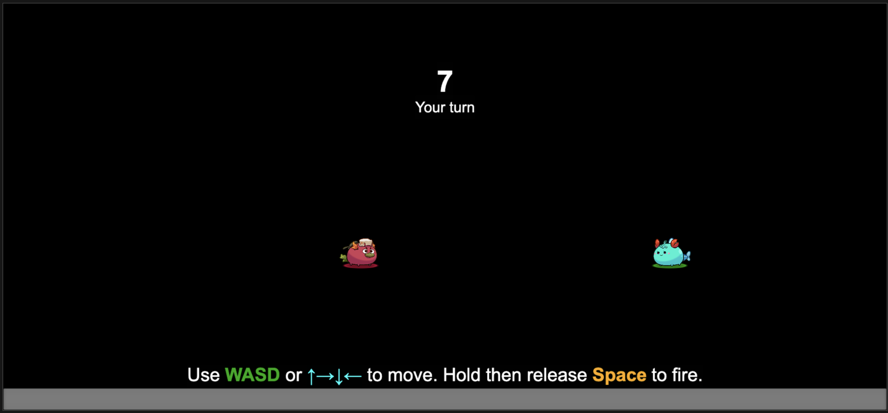
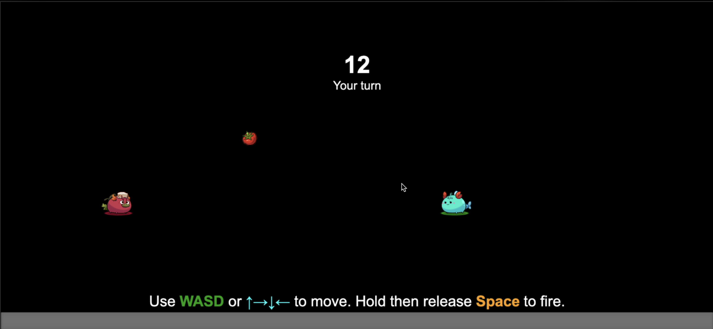

# Bring Axie into Colyseus multiplayer game
This is an example Axie artillery game with Cocos Creator and Colyseus



# Requirements
- Cocos Creator 3.7.1 (or higher)
- Colyseus 0.15.0
- Axies and other Assets: `cc-axie-gtk2d` [(https://github.com/axieinfinity/cc-axie-gtk2d)](https://github.com/axieinfinity/cc-axie-gtk2d)

# Setup before the first run

1. Go to root folder. Then run
`npm install` in the terminal:

```zsh
npm install
```

2. Change directory into folder **server**. Then run npm install in the terminal:

```zsh
cd server
npm install
```

# Run the project
## 1. Run server

Navigate into `server` folder, then run server. By default, Colyseus server is deployed at `localhost:2567`.

```zsh
cd server
npm install
```

## 2. Run client
- Open the root folder by Cocos Creator.
- Open scene `game`, located at `assets/axie-colyseus-demo/scenes/game.scene`.
- If you have made any settings for your Colyseus Server. Goto Node (Cocos GameObject) `Systems` and configure `Hostname`, `Port`, `UseSSL`, `Game Room` to match your server. 
- Run the scene **game**. 

# Game

After run properly, the game will look like this:



## How to play
- 2 players will join the game. The first one plays as **Puffy** (blue Axie) and the other plays as **Pomodoro** (red Axie).
- Players will try to hit each others, turn by turn. The first one throws a **tomato** right into the opponent, is the winner.
- Players use their navigation keys (WASD or Arrows) to move their Axies. Hold **Space** to scale power and relase to fire.
